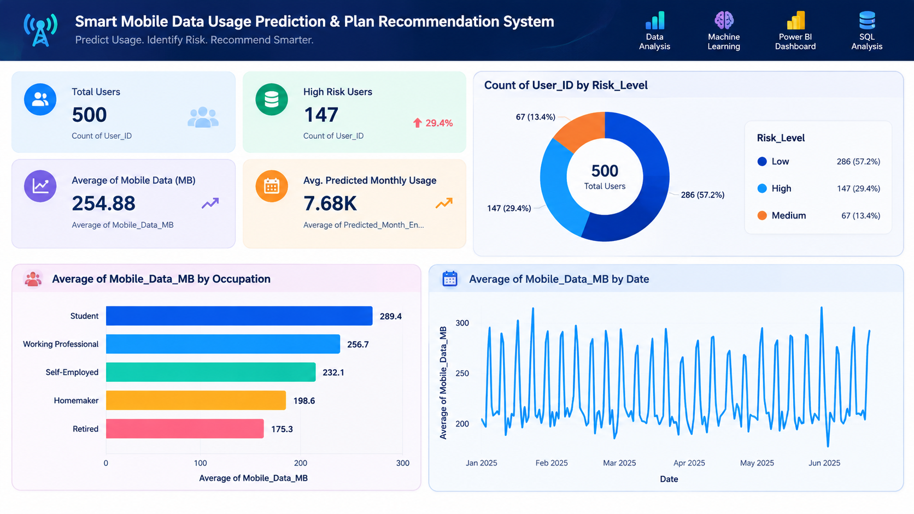

# Smart Mobile Data Usage Prediction & Plan Recommendation System

> **Predict Usage. Identify Risk. Recommend Smarter.**

A Python and Power BI based data analytics and machine learning project that analyzes historical mobile data consumption, predicts future usage, identifies plan exhaustion risk, and provides data-driven recommendations for mobile data management.

---

## 📸 Dashboard Screenshots

### Executive Overview



### Prediction & Risk


### What-If Analysis


---

## 📌 Overview

**Smart Mobile Data Usage Prediction & Plan Recommendation System** is an end-to-end Data Analytics and Machine Learning project designed to understand and predict mobile data consumption patterns.

The project analyzes historical daily mobile data usage across **500 synthetic users over 180 days**, performs data cleaning and exploratory analysis, engineers predictive features, trains machine learning models, forecasts future usage, estimates monthly consumption, predicts plan exhaustion dates, and classifies users into different risk levels.

The final insights are presented through an interactive **Power BI dashboard** for business-friendly decision making.

---

## ⭐ Key Highlights

- 📊 Historical Mobile Data Usage Analysis
- 🤖 Machine Learning Based Usage Prediction
- 🔮 Next-Day Usage Prediction
- 📅 7-Day Usage Forecast
- 📈 Monthly Usage Estimation
- ⚠️ Plan Exhaustion Risk Prediction
- 🟢 Low / 🟡 Medium / 🔴 High Risk Classification
- 💡 Data-Driven Plan Recommendations
- 🔄 What-If Analysis for Streaming Reduction
- 📊 Interactive Power BI Dashboard
- 🗄️ SQL-Based Data Analysis
- 📓 End-to-End Jupyter Notebook

---

## ✨ Features

### 📊 Data Analysis

- Analyze daily mobile data consumption
- Study weekday vs weekend usage patterns
- Analyze usage by occupation
- Analyze usage by age group
- Analyze usage by network type
- Compare mobile data and Wi-Fi usage
- Identify high-consumption applications

### 🤖 Machine Learning

- Feature engineering using historical usage
- Next-day usage prediction
- 7-day usage forecasting
- Monthly usage estimation
- Plan exhaustion date prediction
- Risk classification based on predicted consumption

### 🔍 Risk Analysis

Users are classified into:

- 🟢 **Low Risk**
- 🟡 **Medium Risk**
- 🔴 **High Risk**

Risk levels are determined based on predicted usage relative to the user's available data plan.

### 🔄 What-If Analysis

The project evaluates a scenario where streaming consumption is reduced by **20%**.

This helps identify how reducing streaming usage can affect:

- Monthly data consumption
- Plan exhaustion risk
- Customer risk category

---

## 🧠 Machine Learning Models

Two regression models were evaluated:

| Model | MAE (MB) | RMSE (MB) | R² |
|------|----------:|----------:|---:|
| Linear Regression | 104.0 | 139.2 | 0.467 |
| Random Forest Regressor | Compared | Compared | Compared |

### 🏆 Selected Model

**Linear Regression**

The model achieved:

- **MAE:** 104.0 MB
- **RMSE:** 139.2 MB
- **R² Score:** 0.467

A chronological train-test split was used to avoid future-data leakage.

---

## 🔐 Data Leakage Prevention

To ensure realistic prediction:

- Next-day target is created using future-day shifting
- Historical features use previous-day data
- Rolling features are calculated only from historical observations
- No future actual usage is used as a prediction feature
- Data is split chronologically into training and testing sets
- Forecasting does not use future actual values

---

## 📈 Key Insights

The analysis produced several important findings:

- 📅 Weekend mobile data usage is approximately **21% higher** than weekday usage.
- 📶 Wi-Fi availability reduces mobile data consumption by approximately **57%**.
- 🎓 Students show the highest average mobile data usage.
- 👴 Retired users show the lowest average mobile data usage.
- 🎬 Netflix and YouTube contribute significantly more data consumption than WhatsApp.
- ⚠️ A significant group of users are at high risk of exhausting their data plans.

---

## ⚠️ Risk Distribution

Current project results:

| Risk Level | Users |
|------------|------:|
| Low | 286 |
| Medium | 67 |
| High | 147 |
| **Total** | **500** |

Risk thresholds:

- **Low:** ≤ 85% of plan usage
- **Medium:** > 85% and ≤ 100%
- **High:** > 100%

---

## 🔄 What-If Analysis Results

After applying a **20% reduction in streaming usage**:

- **33 users** moved from Medium Risk → Low Risk
- **25 users** moved from High Risk → Medium Risk

This demonstrates how behavioral changes can reduce mobile data exhaustion risk.

---

## 🛠 Tech Stack

| Category | Technology |
|----------|------------|
| Programming Language | Python 3.11 |
| Data Analysis | Pandas, NumPy |
| Visualization | Matplotlib |
| Machine Learning | Scikit-learn |
| Model Serialization | Joblib |
| Database / Querying | MySQL / SQL |
| Notebook | Jupyter Notebook |
| Dashboard | Power BI |
| Version Control | Git & GitHub |

---

## 📂 Project Structure

```text
Smart-mobile-data-usage-prediction/

├── data/
│   ├── raw/
│   ├── cleaned/
│   └── output/
│
├── eda_charts/
│
├── models/
│   ├── best_next_day_usage_model.joblib
│   └── model_metrics.json
│
├── notebooks/
│   └── mobile_data_prediction.ipynb
│
├── powerbi/
│   ├── dim_customers.csv
│   ├── dim_date.csv
│   ├── fact_daily_usage.csv
│   ├── fact_predictions.csv
│   ├── fact_whatif.csv
│   └── POWERBI_INSTRUCTIONS.md
│
├── scripts/
│   ├── 01_generate_data.py
│   ├── 02_clean_data.py
│   ├── 03_feature_engineering_and_modeling.py
│   ├── 04_predict_forecast_risk.py
│   ├── 05_eda.py
│   └── build_notebook.py
│
├── sql/
│   └── mobile_data_analysis.sql
│
├── screenshots/
│   ├── executive_overview.png
│   ├── prediction_risk.png
│   └── whatif_analysis.png
│
├── .gitignore
└── README.md

---

## 👨‍💻 Developed By

### A.Aravinthasamy B.Tech.(AI & Data Science)
[](mailto:aravinthasamy2006as@gmail.com)
[](https://github.com/Aravinthasamy112)
[](https://www.linkedin.com/in/aravinthasamyas)

---

## 📄 License

This project is licensed under the **MIT License**.

